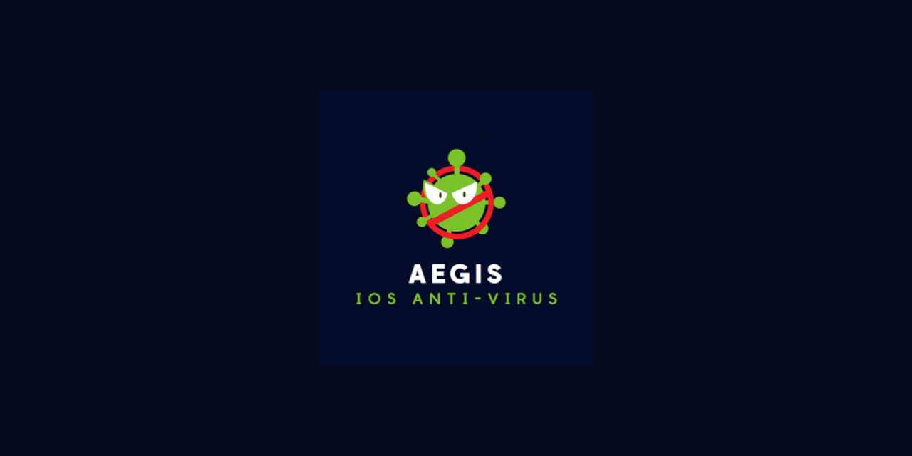
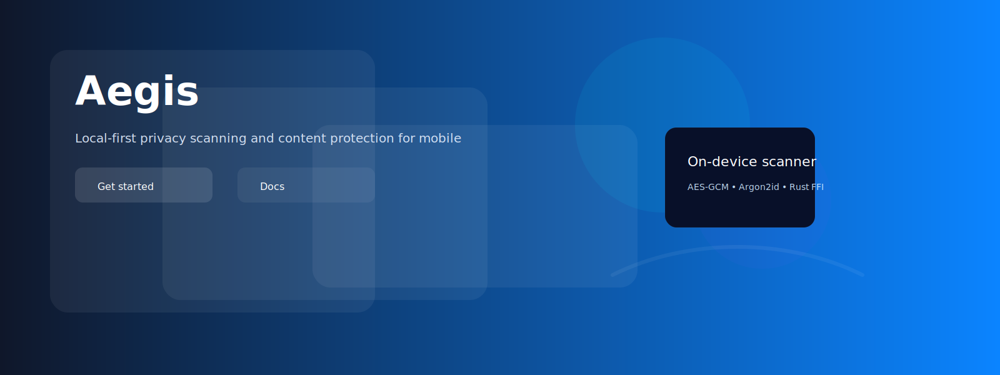
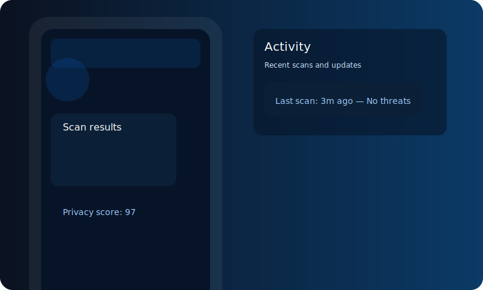
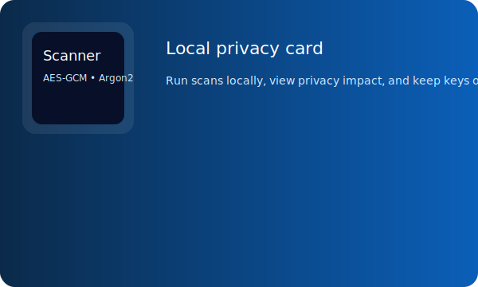

# 

# Aegis - The Mobile Privacy & Content Scanner



Overview
--------

Aegis is a modular mobile privacy and content-scanning platform focused on user-first scanning (file/URL analysis, phishing detection, and privacy reports). The repository includes components for iOS, native scanning engines, and backend services. The design favors a local-first architecture: sensitive analysis runs on-device inside audited native code, and any uploads are explicit and opt-in.

Key technologies
- Swift / SwiftUI (iOS app & wrappers)
- Rust (primary scanning engine) and C++ (performance modules)
- C bridges / Objective-C++ for runtime interop
- Go (backend services for rule distribution and reputation)

Repository layout
---------------

- `ios-app/` - Swift iOS application skeleton and SwiftUI prototypes
- `ios-extensions/` - Network/URL content filter extension stubs (enterprise features)
- `encrypt/` - Rust `encrypt` crate, `local-encrypted` native bindings and scaffolding
- `engine-rust/` - Rust scanning engine and FFI surface
- `engine-cpp/` - Optional C++ matchers and heuristics
- `backend-go/` - Reputation and rule distribution services
- `design/` - Figma starter assets, tokens, and SVG components
- `website/` - Project website and demo pages
- `docs/` - Architecture docs, threat model, and compliance notes

Getting started
---------------

1. Clone the repository and inspect module READMEs for developer workflows.

   git clone git@github.com:1proprogrammerchant/aegis.git

2. Web preview (local): open `website/` and run the static server (requires Python 3):

```bash
cd website
python3 -m http.server 8000
# then open http://localhost:8000
```

3. Rust engine builds: see `engine-rust/README.md` for cargo build targets and packaging to XCFrameworks.

Local encryption (platforms)
---------------------------

- The `encrypt/src/local-encrypted` folder contains a cross-platform approach:
  - Crypto++ AES-GCM implementation for general builds (Linux/macOS CI)
  - Apple-specific `CryptoKit` implementation (`crypto_apple.swift`) for iOS/macOS, exposing C-callable symbols to the C bridge
  - C ABI bridge and Objective-C++ wrappers for easy Swift integration

Apple Developer / App Store notes
--------------------------------

If you plan to run Aegis on an iPhone (App Store, TestFlight, or Ad-hoc), follow Apple requirements:

- Apple Developer Account: You must enroll in the Apple Developer Program (annual fee). See: https://developer.apple.com/programs/
- Code Signing: Build and sign the app/XCFramework with your development/distribution certificate and provisioning profile.
- Entitlements: If you need Network Extension, Content Filter, or VPN capabilities, request the proper entitlements. Apple reviews those closely and may require justification.
- Privacy & App Review: Provide a clear privacy policy, explain why scanning is local-first, and disclose any data uploads. Use Keychain/Secure Enclave for key storage.
- Recommended: Use `CryptoKit` and platform APIs for crypto + Keychain/SE for keys on iOS to maximize auditability and App Store acceptance.

Sample Apple developer resources
- Enroll: https://developer.apple.com/programs/
- Code signing guide: https://developer.apple.com/support/code-signing/
- Network Extension docs: https://developer.apple.com/documentation/networkextension

Apple assets & placeholders
---------------------------

The repository includes neutral, non-branded placeholder images to help layout docs and mockups while you obtain proper permission for Apple's trademarks. Replace them with official assets only if you have the rights to use Apple's logos and badges.

- Placeholders included (replace later):
  - `docs/assets/apple-placeholder.svg`
  - `docs/assets/apple-device-badge.svg`
  - `docs/assets/apple-marketing-placeholder.svg`

- Official Apple marketing and identity resources:
  - Apple Marketing Guidelines: https://www.apple.com/marketing/guidelines/
  - Apple Design Resources: https://developer.apple.com/design/resources/
  - Apple trademark & logo usage guidance: https://www.apple.com/legal/intellectual-property/guidelinesfor3rdparties/

Use the official resources to download appropriate logos/badges and follow Apple's usage rules when preparing App Store screenshots, marketing material, or documentation.

Building for iOS
----------------

- Create an Xcode target importing the `encrypt` native library (as an XCFramework or static lib) and include the Objective-C++ wrapper `objc/LocalEncrypt.mm` with the bridging header to expose the API to Swift.
- For CI builds that produce an XCFramework, use a macOS runner with the iOS SDK and ensure required signing keys are available as secrets.

Security & Privacy
------------------

- Keep the FFI surface minimal and well-documented - each exported function must be audited and covered by tests.
- Store keys in Keychain / Secure Enclave; never persist raw keys in plaintext on disk.
- Sign and verify rule packs and updates; prefer authenticated updates.

Contributing
------------

See `CONTRIBUTING.md` (if present) and open issues or pull requests. We welcome help with platform builds (macOS CI), rule writing, and testing on real devices.

License
-------

This repository contains multiple components. Choose a license suitable for your distribution; for Apple App Store distribution you must ensure third-party library licenses (e.g., Crypto++) are compatible with your chosen license.

For the iOS app and client components we recommend an explicit license header and a LICENSE file at the repo root. (TBD - add your preferred license.)
-----------




Resources / Reading List
------------------------

The repository includes a set of local reference PDFs useful for security, cryptography, and mobile platform guidance. Downloaded copies are available in `docs/resources/` for offline reading.

Updated local resources (actual files present)
- **Apple Platform Security (local copy)** - [docs/resources/apple-platform-security-guide.pdf](docs/resources/apple-platform-security-guide.pdf)
- **Argon2 specification** - [docs/resources/argon2-specs.pdf](docs/resources/argon2-specs.pdf)
- **NIST SP 800-38D (GCM)** - [docs/resources/nist-sp-800-38d.pdf](docs/resources/nist-sp-800-38d.pdf)
- **NIST SP 800-63-3 (Digital Identity)** - [docs/resources/nist-sp-800-63-3.pdf](docs/resources/nist-sp-800-63-3.pdf)
 - **Secure Coding / C/C++ (provided)** - [docs/resources/secure%20coding%20in%20c%20and%20c%2B%2B.pdf](docs/resources/secure%20coding%20in%20c%20and%20c%2B%2B.pdf)
 - **Cryptography in C and C++ (Welschenbach)** -[docs/resources/Welschenbach%20M.%20Cryptography%20in%20C%20and%20C%2B%2B%20%282ed.%2C%20Apress%2C%202005%29%28ISBN%201590595025%29%28O%29%28504s%29_CsCr_.pdf](docs/resources/Welschenbach%20M.%20Cryptography%20in%20C%20and%20C%2B%2B%20%282ed.%2C%20Apress%2C%202005%29%28ISBN%201590595025%29%28O%29%28504s%29_CsCr_.pdf)

Contact
-------
email: sacehenry@gmail.com
For collaboration, please open an issue or contact the me at the GitHub repository: https://github.com/1proprogrammerchant/aegis